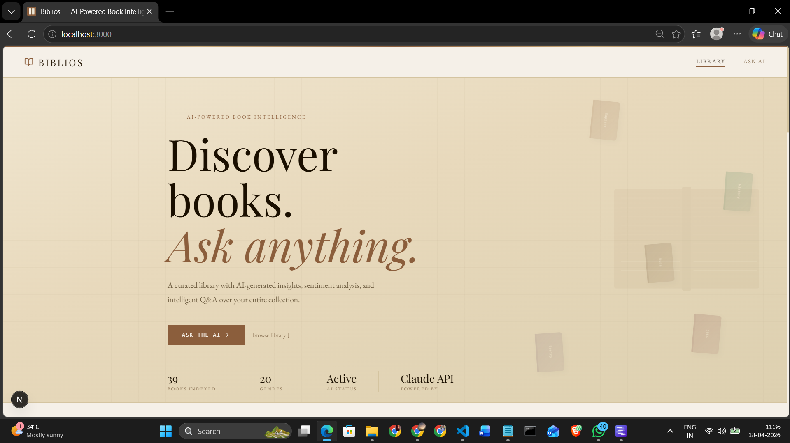
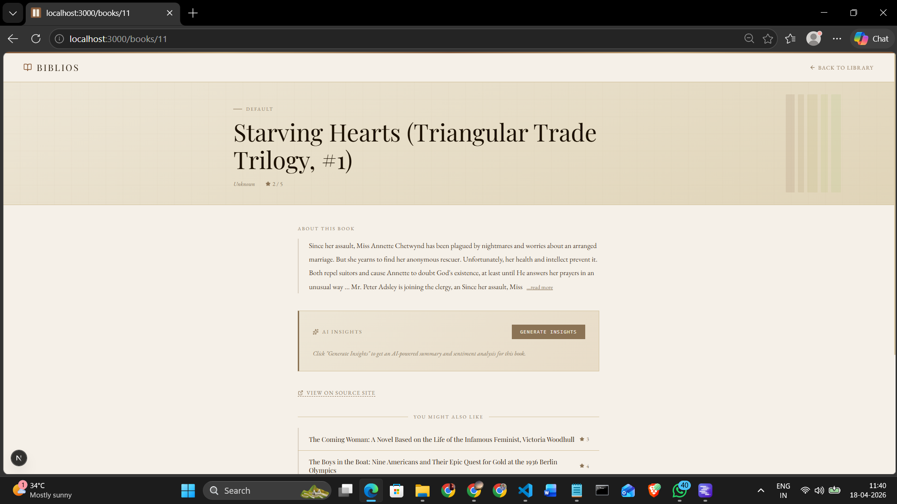
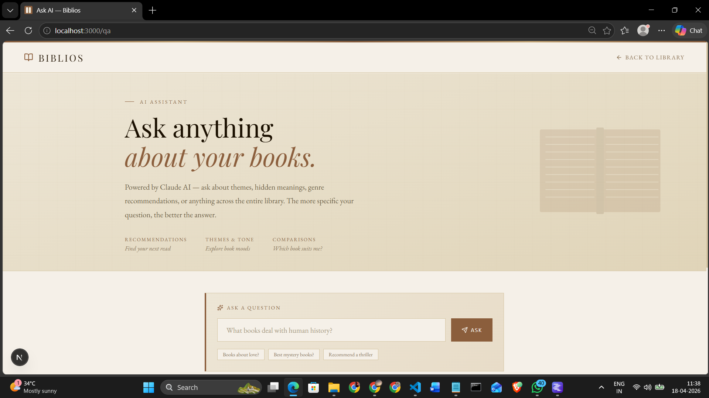

# Biblios — AI-Powered Book Intelligence Platform

A full-stack web application that scrapes book data, generates AI insights, and supports intelligent question-answering over a curated book collection.

## Screenshots





## Tech Stack

- **Backend**: Django REST Framework (Python)
- **Database**: SQLite
- **Vector Store**: ChromaDB
- **AI Model**: TinyLlama 1.1B (via LM Studio)
- **Scraping**: BeautifulSoup + Requests
- **Frontend**: Next.js + Tailwind CSS

## Features

- Automated book scraping from books.toscrape.com
- AI-generated summaries and sentiment analysis
- RAG-based question answering over the book collection
- Book recommendations by genre
- Modern dark UI with grid and list views

## Setup Instructions

### Prerequisites
- Python 3.10+
- Node.js 18+
- LM Studio with TinyLlama downloaded

### Backend Setup

```bash
# Clone the repo
git clone https://github.com/PrajaktaSarkhel/book-insight-app.git
cd book-insight-app

# Create and activate virtual environment
python -m venv venv
venv\Scripts\activate        # Windows
source venv/bin/activate     # Mac/Linux

# Install dependencies
pip install -r requirements.txt

# Run migrations
cd backend
python manage.py migrate

# Start backend server
python manage.py runserver
```

### AI Setup (LM Studio)
1. Download [LM Studio](https://lmstudio.ai/)
2. Search and download `tinyllama-1.1b-chat-v0.6`
3. Go to Local Server tab → Load model → Start Server
4. Server runs at `http://localhost:1234`

### Scraper

```bash
cd scraper
python scrape.py
```

### Frontend Setup

```bash
cd frontend
npm install
npm run dev
```

Frontend runs at `http://localhost:3000`

## API Documentation

| Method | Endpoint | Description |
|--------|----------|-------------|
| GET | `/api/books/` | List all books |
| GET | `/api/books/<id>/` | Get book detail |
| GET | `/api/books/<id>/recommend/` | Get similar books |
| POST | `/api/books/upload/` | Add a new book |
| POST | `/api/books/<id>/insights/` | Generate AI insights |
| POST | `/api/ask/` | Ask a question (RAG) |

## Sample Questions & Answers

**Q: What books are about history?**
> Based on the collection, "Sapiens: A Brief History of Humankind" covers human history from early humans to modern civilization...

**Q: Recommend me a mystery book**
> Based on your interest in mystery, you might enjoy "Sharp Objects" — a dark, thrilling story...

**Q: What is the highest rated book?**
> The collection includes several 5-star rated books including "Sophie's World" and "The Four Agreements"...